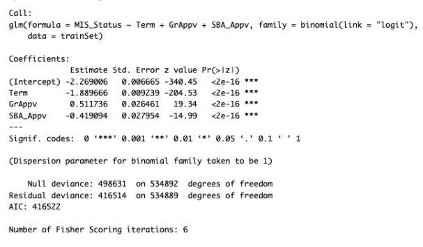
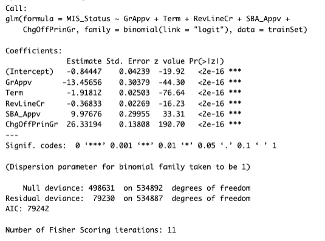
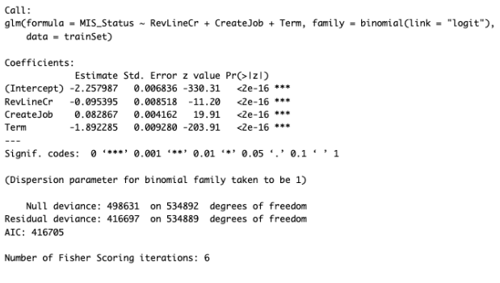

## SBA-loan-approval-classification-models-r
In this project, I designed 3 classification models to predict whether U.S. Small Business Administration (SBA) loan applications could be at higher risk or lower risk of default. Using my insights gathered from data preprocessing and data exploration, I was able to help solve the problem that the SBA and banks faced when deciding whether to approve or deny loan applications to the various small business applicants, which is the fact that banks could incur losses in the case a small business defaults on a loan. By calculating the probability of default using various historical data from the SBA, the models made are more reliable than taking an educated guess.

## 📘 R script
You can view the R-script file here:

## 📊 Classification Model Results: Output

### 🎯 Model 1 Output

### 🎯 Model 2 Output

### 🎯 Model 3 Output

