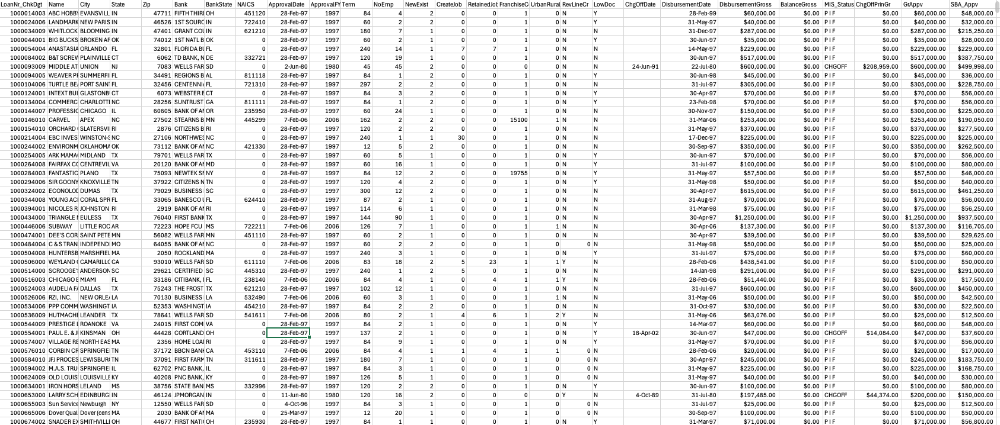
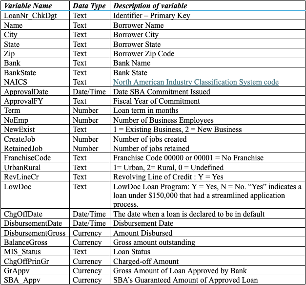

## SBA-loan-approval-classification-models-r
In this project, I designed 3 classification models to predict whether U.S. Small Business Administration (SBA) loan applications (a dataset with more than 899,000 entries) could be at higher risk or lower risk of default. Using my insights gathered from data preprocessing and data exploration, I was able to help solve the problem that the SBA and banks faced when deciding whether to approve or deny loan applications to the various small business applicants, which is the fact that banks could incur losses in the case a small business defaults on a loan. By calculating the probability of default using various historical data from the SBA, the models made are more reliable than taking an educated guess.

## 🗂️ Excel Dataset File Preview and Variable Interpretation

### 📈 Dataset Preview

### 📝 Dataset Variable Interpretation

## 📘 R script Code
You can view the R-script file here:

## 📊 Classification Model Results: Output

### 🎯 Model 1 Output

### 🎯 Model 2 Output

### 🎯 Model 3 Output

## 💡 Conclusions, Patterns, and Insights
Since the summary statistics, including the accuracy, specificity, and sensitivity rates for models 1
and 2 were not as good as the rates for model 3, I conclusively determined that the second model is, in
fact, the best fit for the data. To explain the outcome of my model, when the predicted outcome of an
application is 1, it is more likely to be charged-off, and when it is 0, it is more likely to be paid in full. If a
loan given to the application is likely to be charged-off, SBA will incur a loss. It seems that the variables
GrAppv, Term, RevLineCr, SBA_Appv, and ChgOffPrinGr are the most relevant to finding out whether a
loan is likely to be charged off. With similar historical data, we can classify each application according to
the different variables and use this classification to accurately estimate a result. Thus, I recommend that
the best action that SBA should take is to use my second model in the future for predicting whether a
business should be given a loan, since they can see how likely it is for them to suffer a loss through a
charge-off from the results of my model.
